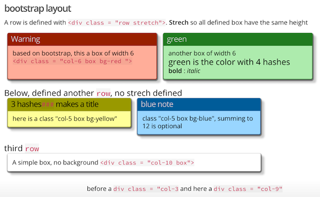
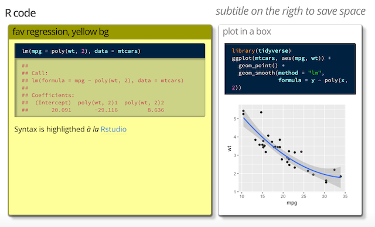

```{r setup, include=FALSE}
knitr::opts_chunk$set(echo = TRUE)
```


CSS and R package by [Eric Koncina](https://github.com/koncina/iosp)

see demo [here](https://htmlpreview.github.io/?https://github.com/ginolhac/iosp_demo/blob/master/iosp.html)

## Screenshots



---


